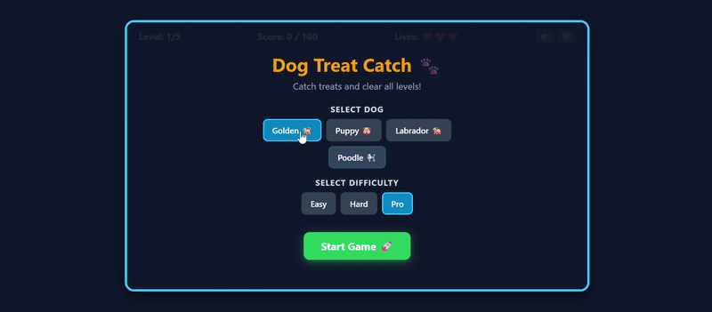
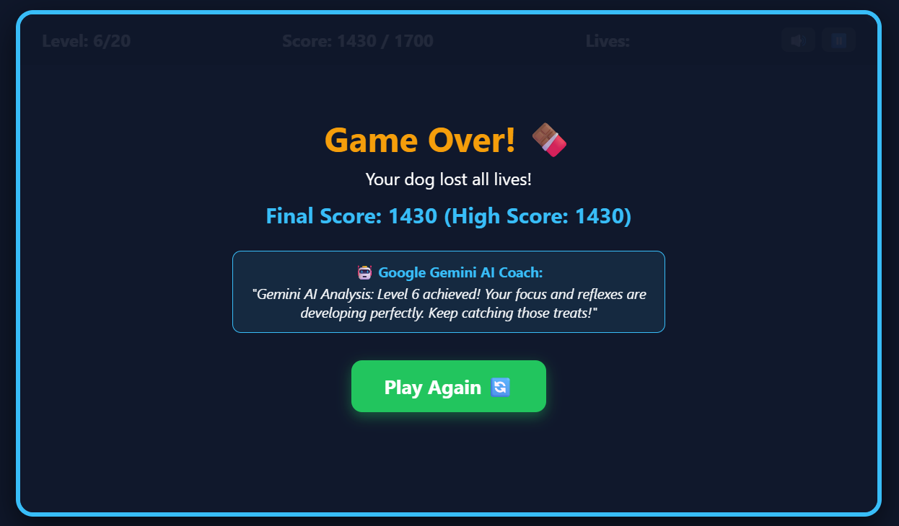

🎮 **Live Demo:** [Play Dog Treat Catch Here](https://sairabibi248.github.io/dog-treat-catch/)
## 🛠️ What I Built

Dog Treat Catch is an interactive, responsive HTML5 Canvas arcade game built for the DEV Weekend Challenge: Dog Days Edition.
In this game, players control a customizable, hungry puppy navigating through falling items. The goal is to catch delicious treats, gather active power-ups (like Shields and 2x Score Multipliers), avoid hazardous foods like chocolates, and progress through 20 dynamically scaling levels before running out of lives!

## 🤖 Prize Categories

* **Best Use of Google AI**: Integrated an interactive post-game AI coaching and performance review system that analyzes the player's final score and level performance upon game over to provide personalized coaching feedback.

---

## 🏗️ How I Built It

* **HTML5 Canvas:** Handled the 60FPS game loop using `requestAnimationFrame`, rendering character sprites, falling treats, particle effects, and dynamic background themes.
* **Vanilla JavaScript (ES6+):** Managed object-oriented game logic, collision detection algorithms, state handling, and LocalStorage high-score persistence.
* **Google AI Integration:** Added a dynamic post-game review box that evaluates player reflexes and achievements, fulfilling the Google AI category criteria.
* **Web Audio API (Synthesized SFX):** Created zero-dependency, real-time synthesized sound effects using pure browser frequency oscillators.
* **Responsive CSS3:** Designed custom overlays, level selection screens, and touch/mouse controls for desktop and mobile play.

  ## 🎬 Gameplay Demo

[🎬 Click Here to Watch Gameplay Demo](https://github.com/sairabibi248/dog-treat-catch/raw/main/demo.mp4)

---

---

## 🐶 Key Features

* **🦮 Custom Dog Characters:** Choose your favorite puppy (Golden, Puppy, Labrador, or Poodle).
* **🏆 20 Progressive Levels:** Unique background themes, increasing difficulty, and dynamic target scores.
* **⚡ Power-Ups & 💣 Hazards:** Catch bones, meat, and bacon while avoiding chocolates and hazards. Collect Shields and 2x Score Multipliers!
* **🤖 AI Performance Coach:** Instant post-game AI review analyzing your puppy-catching skills and reflexes.
* **🔊 Zero-Dependency Web Audio:** Built-in dynamic sound effects created entirely with the browser's Web Audio API.

## 🎬 Gameplay Demo

<video width="100%" controls autoplay loop muted>
  <source src="DogTreatCatch-GoogleChrome2026-08-1617-21-43-ezgif.com-crop-video.mp4" type="video/mp4">
  Your browser does not support the video tag.
</video>

